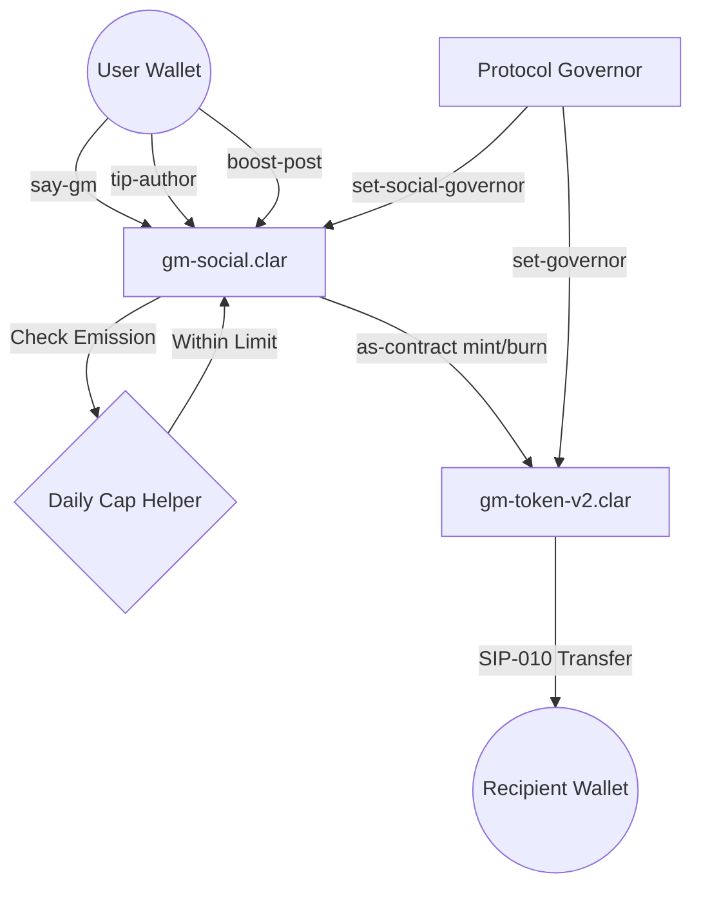

# Gm Social Protocol ☀️


[](https://hiro.so/clarinet)
[](https://stacks.co)
[](LICENSE)
[](#security-v2-hardening)

**Gm Social Protocol** is the premier decentralized social networking primitive on the Stacks blockchain. Built on Bitcoin's security, Gm enables a reputation-based social ecosystem where "GMing" is a core economic action.

---

## 🛡️ Security V2 Hardening
The protocol has recently undergone a major **V2 Security Refactor** to ensure long-term stability and economic protection:

- **Macro-Economic Emission Cap**: A global daily limit of 50M micro-GM to prevent token inflation.
- **Micro-Rate Limiting**: Anti-spam cooldowns for high-frequency social actions (Following/Boosting).
- **Social Governance**: Dedicated protocol governor for future DAO/Multi-sig evolution.
- **Context-Safe Bridge**: Authorization-hardened cross-contract calls between `gm-social` and `gm-token`.

---

## 🏗️ Protocol Architecture



---

## 🪙 Tokenomics
The **$GM Token** is a SIP-010 compliant fungible token that powers the Gm ecosystem.

- **Rewards**: Earn GM by daily check-ins and receiving tips.
- **Utility**: Burn GM to Boost posts and increase their visibility weight.
- **Governance**: Vote on community proposals with your GM balance.

---

## 🚀 Getting Started

### Prerequisites
- [Clarinet](https://github.com/hirosystems/clarinet)
- [Stacks Wallet](https://www.hiro.so/wallet)

### Installation
```bash
# Clone the repository
git clone https://github.com/TheWeirdDee/gm-dapp.git

# Navigate to project
cd gm-dapp

# Run contract tests
clarinet test

# Verify build
clarinet check
```

---

## 🤝 Contributing
We welcome contributions from the **Stacks** and **Talent Protocol** communities!

1. Fork the Project
2. Create your Feature Branch (`git checkout -b feature/AmazingFeature`)
3. Commit your Changes (`git commit -m 'Add some AmazingFeature'`)
4. Push to the Branch (`git push origin feature/AmazingFeature`)
5. Open a Pull Request

---

## 📜 License
Distributed under the MIT License. See `LICENSE` for more information.

---

**Gm.** 🚀
